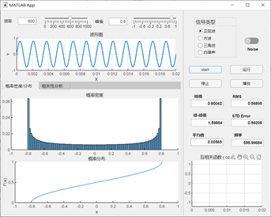
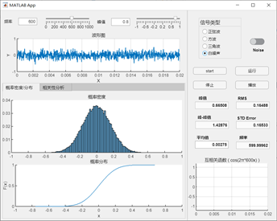
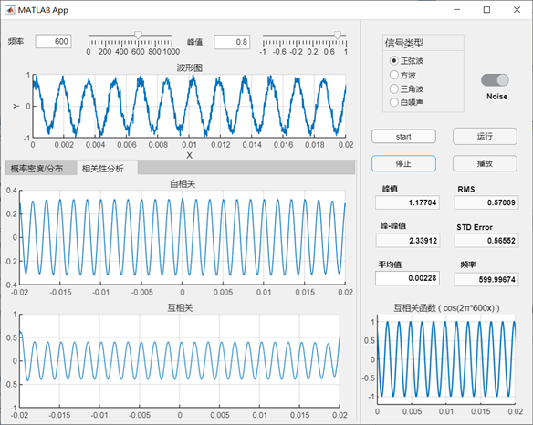
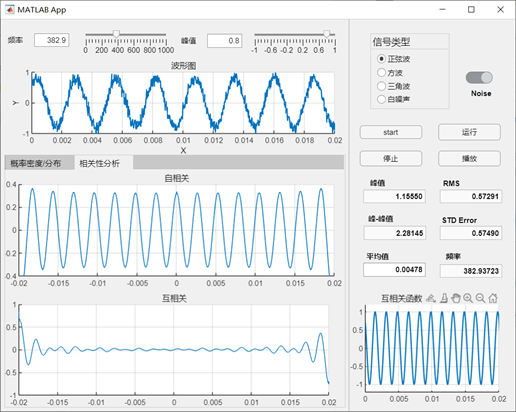

# **概率密度/分布及相关性分析**

## **1. 概率密度及概率分布模块**

 

在之前完成的信号发生器的基础上，我加入了概率密度和分布的分析计算功能，主要通过函数 *histogram（）* 来绘制概率密度直方图，通过 *ecdf（）* 函数来绘制概率分布曲线。然后将波形图中的信号放入函数中就可以很容易地得到相关概率密度及分布的图像。

## **2. 相关性分析模块**

  相关性分析采用的是matlab自带的 *xcorr（）* 函数，自相关和互相关的区别就在于输入参数的不同。整体代码上并没有太大困难。在信号中加入噪声后，得到的自相关图像如下所示，可以看出自相关分析对于过滤噪声有很好的效果。

### **互相关验证**
关于互相关的验证，之前设置的与信号进行互相关分析的余弦函数的频率是600Hz，在上面的图中可以看出，两周期信号互相关函数仍然是同频率周期信号，且保留原了信号相位信息。
当调整信号频率不同于600Hz后得到的互相关图像如下所示，验证了两个非同频率的周期信号互不相关。

