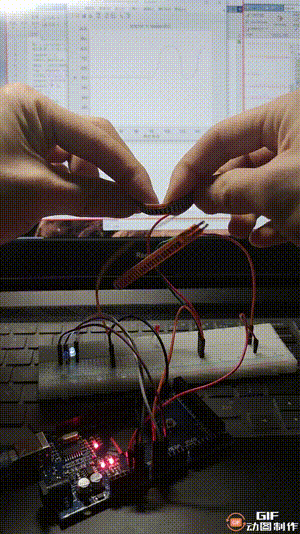

# Arduino传感器以及与Matlab的通信

   采用的传感器是弯曲度传感器,弯曲度传感器相当于是一个滑动变阻器，在正常伸直的时候电阻为25kΩ，弯曲的时候电阻增大为30-100kΩ。根据此特性，可以做一个分压电路，加上两个LED灯，可以使电阻的变化可视化。

## 传感器与Arduino的接线如下所示：

### Arduino代码见: [flex.ino](flex/flex.ino)
### MATLAB代码见：[aduino.m](aduino.m)

在弯曲度传感器发生形变时，Arduino串口发送给的Matlab信号随时间的变化绘出如下所示：

## 总体效果如下：

